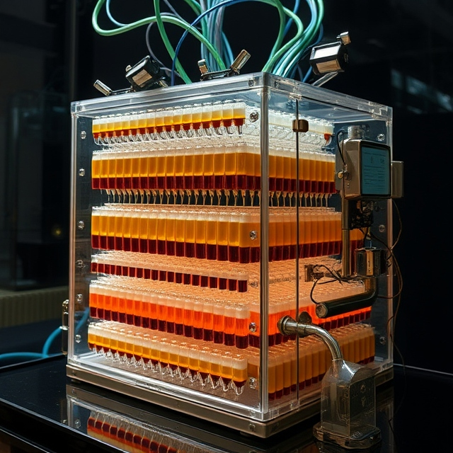
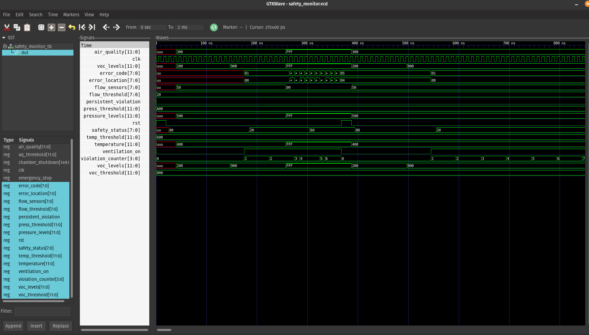
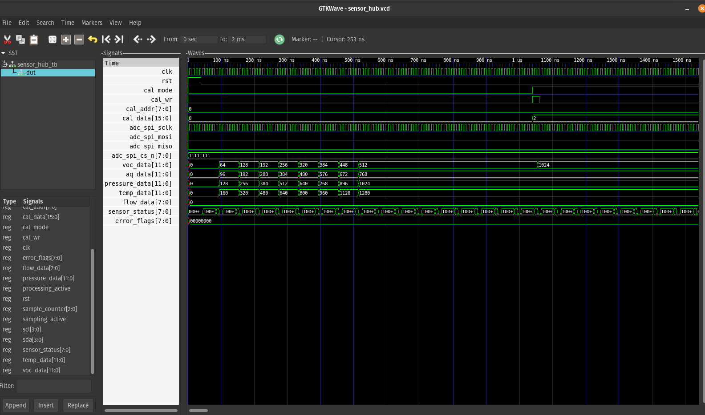

# NΞBKISØ OLFACTORY SEQUENCER: Programmable Hyperrealist Scent Experience System

```
cat fpga/README.md
cd fpga/sim
make
make test
make sim_sensor
make view_sensor
```


## Core Technology



---

### GTKWave images




### Molecular Dispensing System
1. **Precision Control**
   - 0.01ml dispensing accuracy
   - Individual molecular isolation
   - Cross-contamination prevention
   - Real-time flow adjustment
   - Pressure-normalized delivery

2. **Cartridge Architecture**
   - Quick-connect molecular pods
   - Contamination-free switching
   - Individual note isolation
   - Temperature-controlled storage
   - Pressure-equalized chambers

3. **Mixing Technology**
   - Molecular-level blending
   - Laminar flow control
   - Turbulence management
   - Phase separation prevention
   - Homogeneous distribution

### Atmospheric Control
1. **Environment Management**
   - Temperature range: 10-40°C (±0.1°C)
   - Humidity control: 20-80% (±1%)
   - Pressure regulation: 0.8-1.2 atm
   - Air filtration: HEPA + Molecular
   - Circulation control: 0.1-2.0 m/s

2. **Spatial Distribution**
   - Multi-zone targeting
   - Gradient creation
   - Boundary management
   - Diffusion control
   - Concentration mapping

### Sequencing System
1. **Timeline Control**
   - Millisecond precision
   - Multi-track sequencing
   - Phase synchronization
   - Evolution management
   - Transition control

2. **Experience Programming**
   - Note scheduling
   - Intensity curves
   - Evolution mapping
   - Interaction points
   - Trigger systems

## Experience Creation
### Composition Tools
1. **Scent Architecture**
   - Layer building
   - Note scheduling
   - Evolution design
   - Transition mapping
   - Intensity control

2. **Interactive Elements**
   - Trigger points
   - Conditional releases
   - Environmental response
   - User interaction
   - Adaptive evolution

### Programming Interface
1. **Timeline Editor**
   - Visual composition
   - Real-time preview
   - Layer management
   - Track organization
   - Transition design

2. **Parameter Control**
   - Molecular ratios
   - Release timing
   - Evolution curves
   - Environmental settings
   - Interaction points

## Technical Specifications
### Hardware Components
1. **Dispensing System**
   - Precision solenoid valves
   - Positive displacement pumps
   - Thermal mass flow sensors
   - Pressure equilibration
   - Anti-contamination barriers

2. **Atmospheric Control**
   - Peltier temperature control
   - Ultrasonic humidification
   - HEPA+Carbon filtration
   - Laminar flow management
   - Pressure regulation

3. **Mixing Chamber**
   - Turbulent flow mixers
   - Static mixing arrays
   - Phase separation prevention
   - Temperature stabilization
   - Pressure normalization

### Software Architecture
1. **Control System**
   - Real-time processing
   - Multi-thread management
   - Error correction
   - Adaptive control
   - Performance optimization

2. **User Interface**
   - Visual timeline
   - Real-time monitoring
   - Parameter adjustment
   - Experience preview
   - System diagnostics

## Experience Types
### Programmed Sequences
1. **Linear Evolution**
   - Timed release
   - Gradual transformation
   - Controlled progression
   - Phase transitions
   - Note development

2. **Interactive Experiences**
   - User triggers
   - Environmental response
   - Adaptive evolution
   - Conditional paths
   - Dynamic adjustment

3. **Atmospheric Design**
   - Space definition
   - Mood creation
   - Environmental harmony
   - Temporal design
   - Spatial progression

### Application Scenarios
1. **Installation Art**
   - Gallery experiences
   - Interactive exhibitions
   - Temporal sculptures
   - Spatial compositions
   - Olfactory performances

2. **Retail Environment**
   - Brand experiences
   - Product storytelling
   - Space definition
   - Customer journey
   - Emotional design

3. **Research Applications**
   - Scent development
   - Evolution studies
   - Interaction testing
   - Performance analysis
   - Experience optimization

## Maintenance Systems
### Quality Control
1. **Monitoring**
   - Real-time analysis
   - Performance tracking
   - Contamination detection
   - System diagnostics
   - Calibration checking

2. **Cleaning Protocols**
   - Automated purging
   - Solvent cleaning
   - UV sterilization
   - Molecular filtration
   - System regeneration

### Service Requirements
1. **Regular Maintenance**
   - Cartridge replacement
   - Filter changes
   - System calibration
   - Performance testing
   - Component inspection

2. **Emergency Protocols**
   - Contamination response
   - System purge
   - Emergency shutdown
   - Ventilation control
   - Safety procedures
